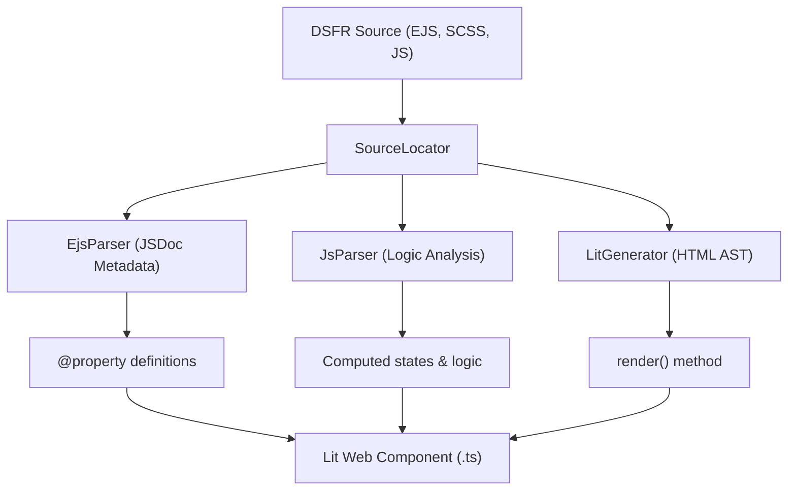

# Contributor Guide: Component Generation

This guide explains how `dsfr-kit` automates the creation of Lit-based Web Components from upstream DSFR source files.

## Overview: The Hybrid AST Strategy

To avoid the fragility of regex-based parsing, the generator uses a multi-stage pipeline that combines JSDoc metadata, HTML AST, and masked JS AST.



## Generation Pipeline

### 1. Metadata Strategy (JSDoc)
The component API contract (properties and types) is derived from structured JSDoc comments at the top of DSFR EJS files using `comment-parser`.

### 2. Logic Analysis (Masked JS AST)
EJS scriptlets are tokenized and transformed into a "masked" JavaScript string.
- HTML is replaced by whitespace to preserve line numbers.
- EJS tags are wrapped in helper functions to create valid JS syntax.
- `@babel/parser` then analyzes the resulting AST for semantic meaning (e.g., variable usage, control flow).

### 3. Template Transformation (HTML AST)
The visual structure is manipulated as a DOM tree using `node-html-parser`. This allows:
- Precise attribute modification.
- Safe injection of Lit bindings (`${this.foo}`).
- Event listener mapping (e.g., mapping `aria-expanded` to `@click="${this.toggle}"`).

## Development Usage

The CLI generator is intended for **internal development only**.

### Pre-requisites
Ensure you have built the generator and CLI packages:

```bash
just build
```

### Generating a Component

Run the generator from the root using `pnpm`:

```bash
# General syntax
pnpm --filter @dsfr-kit/cli run generate <component> --output <dir>

# Example: Regenerate the Accordion
pnpm --filter @dsfr-kit/cli run generate accordion --output packages/lit/src/components/accordion
```

## Troubleshooting

### "Could not find source for X"
- Ensure the `@gouvfr/dsfr` package is installed in `node_modules`.
- Check `packages/generator/src/source-locator.ts` for directory mapping logic.

### Broken Template Output
- If the generated `render()` method has syntax errors, check if the EJS contains complex logic not yet supported by the `LitGenerator`.
- You may need to manually "tweak" the generated component to fix complex EJS helpers.

### Missing Styles
- Verify that the `StyleResolver` correctly identifies all required CSS modules for the component.
- Check `packages/styles/src/index.ts` to see if the required base styles are exported.

## Extending the Generator

To support new EJS patterns:
1.  Add a test case in `packages/generator/test`.
2.  Update `LitGenerator.ts` to handle the new `data-ejs-*` attribute mapping.
3.  Verification: Ensure the output Lit template is valid and reactive.
